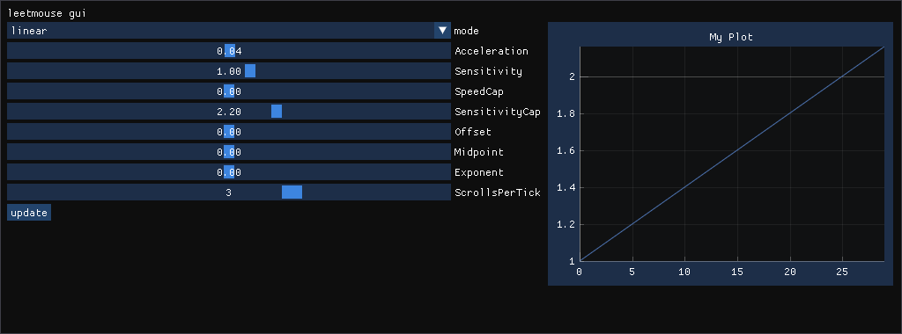

# leetmouse-gui

Fork of the simple GUI for Skyl3r's fork of leetmouse (https://github.com/Skyl3r/leetmouse)
or for my fork (https://github.com/c4llv07e/leetmouse-gui)
rewritten in C++ and ImGUI (with ImPlot).
This program assumes you've already installed the leetmouse driver.

## Cloning

Don't forget to clone repo with all submodules

``` git clone --recurse-sumbodules https://github.com/c4llv07e/leetmouse-gui.git ```

or

``` git submodule init ```



## Requirements

- GLFW

## Build

``` make ```

## Use

Since this program must change module parameters it needs root access:

``` sudo ./leetmouse-gui ```

or

``` sudo make run ```


## Todo

- Better graph
